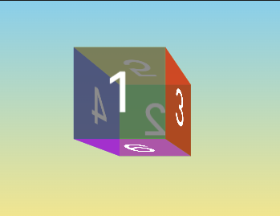
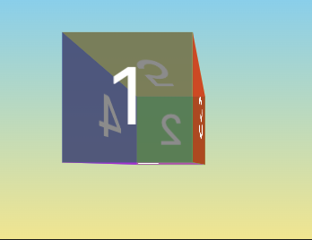
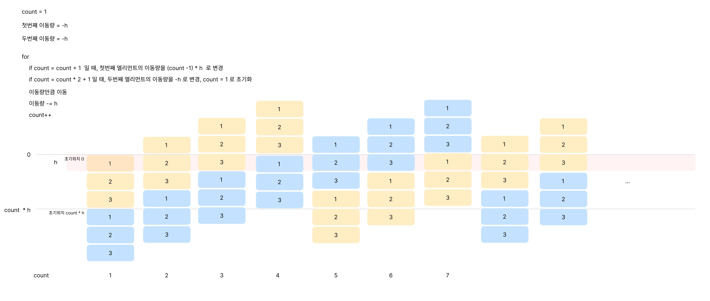

# 애니메이션 컴포넌트 모음

애니메이션이 적용된 다양한 컴포넌트(header, footer, navigation...) 구현 모음 및 배운 내용 정리

## ✅ Header1

🔥 https://gsap-components-example.vercel.app/header/1

### required package

- gsap, @gsap/react
- react-icons

### What I Learned

- gsap 의 fromTo 메서드 사용 시 특수 프로퍼티들(duration, delay, etc)은 from 에 넣지 말고 to 에 넣어야 한다.

## ✅ Page transition 1

🔥 https://gsap-components-example.vercel.app/page-transition/1

### required package

- gsap, @gsap/react
- react-icons
- lenis

### What I Learned

- svg mask 기능으로 글씨가 써지는 애니메이션 동작 시 원하는 모양으로 보이도록 하기
- strokeDasharray, strokeDashoffset 을 이용하여 서서히 보여지는 패스 애니메이션 구현

## ✅ Hero 2

🔥 https://gsap-components-example.vercel.app/hero/2

### What I Learned

- css 의 perspective 를 이용하여 3d 처럼 보이도록 구현

```css
.parent {
  transform-style: preserve-3d;
}

.children {
  perspective: 400px;
}
```

perspective 를 적용하기 위해선 부모 요소의 transform-style 을 preserve-3d 로 변경해야 한다.
perspective 를 적용하면 z 값에 따라 요소가 작아 보이거나 커 보이도록 할 수 있다. perspective 값이 클 수록 z 값이 같을 때 크기 변형이 작아보인다.

[persepctive 800px]



[perspective 200px]



## ✅ Card 1

🔥 https://gsap-components-example.vercel.app/card/1

카드 컴포넌트 추가, 삭제 시 유저에게 어떤 카드 컴포넌트에 행위가 적용되고 있는지 알려주는 마이크로 인터렉션 구현

### What I Learned

- ::after, ::before 요소를 활용하여 border 색상, 배경 색상 변경 애니메이션 구현

## ✅ Header 2

🔥 https://gsap-components-example.vercel.app/header/2

`:has` 를 사용하여 hover 된 요소 이외의 다른 요소를 흐리게 하여 hover 된 요소를 강조

## ✅ Card 2

🔥 https://gsap-components-example.vercel.app/card/2

- `flex-grow` 를 동일한 값으로 설정하여 width(height) 비율에 따라 각 엘리먼트의 width(height)가 할당되도록 함.
  `flex-grow` 만 설정하면 `flex-basis` 는 `auto` 값이 유지되기 때문에 width(height) 값이 참조된다.

## ✅ Hero 3

🔥 https://gsap-components-example.vercel.app/hero/3

- `setTimeout` 을 이용한 infinite vertical carousel 구현
- 애니메이션을 위해 추가된 기존 요소와 같은 크기의 요소는 `area-hidden` 으로 accessibility tree 에서 해당 요소를 없앰



## ✅ Carousel 1

🔥 https://gsap-components-example.vercel.app/carousel/1

gsap 의 `Draggable` 플러그인으로 드래그 가로 캐러셀 구현

```javascript
// scroller : 드래그 할 스크롤
// wrapper : 스크롤 되는 요소
Draggable.create(scroller, {
  type: "x",
  bounds: {
    minX: gap,
    maxX: timelineWidth - scrollerWidth - gap,
  },
  onDrag() {
    const progress = (this.x - gap) / maxDragX;
    const wrapperX = -400 * (timelineWidth / 100) * progress;

    moveX(wrapperX);
  },
});
```

- 드래그마다 gsap.to 를 사용하여 캐러셀 엘리먼트 이동시킬 때 최적화를 위해 `to` 대신 `quickTo` 를 사용하는 것이 좋다.(짧은 간격으로 to 호출하는 경우 quickTo 를 사용하는 것이 권장됨. ex. 마우스 포인터를 트래킹하는 엘리먼트)
- 엘리먼트 삭제: `el.remove()`

## Carousel 2

🔥 https://gsap-components-example.vercel.app/carousel/2

- `setPointerCapture` : 포인터가 특정 요소에 눌려있는 동안 움직임이나 해제 이벤트를 그 요소에게 독점적으로 전달함.
  요소 밖에서 mouseup 을 받지 못해 상태가 꼬이는 것을 방지.
